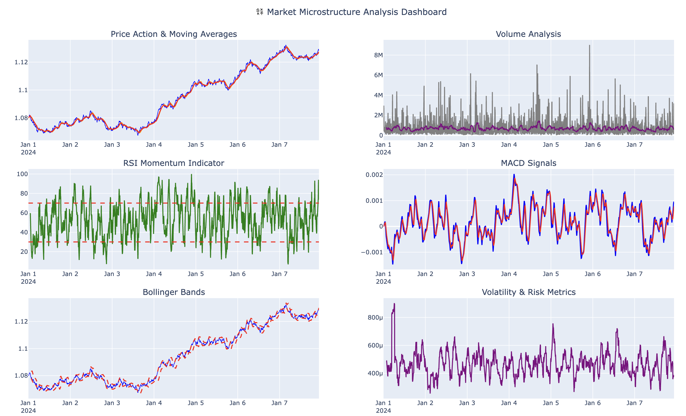
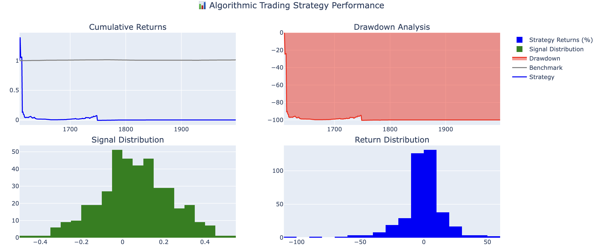

Algorithmic Trading Strategy
📈 Algorithmic Trading Strategy: Momentum-Based Backtesting Engine
This repository showcases a prototype algorithmic trading engine that identifies and backtests momentum-based strategies on U.S. equity market data. Designed as part of my self-driven learning in quantitative finance, the project reflects my interest in applying data science and machine learning to real-world trading problems.

🚀 Project Goals
Identify high-performing stocks using momentum indicators (RSI, SMA crossovers)
Automate strategy generation and evaluation over historical periods
Visualize key metrics (cumulative returns, drawdowns, Sharpe ratios)
Build an extendable pipeline that can integrate with live trading environments
🛠️ Technologies Used
Python (data manipulation, modeling)
Pandas, NumPy, TA-Lib, yfinance
Matplotlib, Seaborn for data visualization
Jupyter Notebook for prototyping and iteration
Git/GitHub for version control
📊 Strategy Overview
We tested a momentum-based strategy combining:

RSI (Relative Strength Index): Buy signal under 30, sell over 70
Moving Average Crossover: 10-day vs 50-day
Optional filters: price volatility, volume threshold
Backtesting logic evaluates:

Entry/exit logic based on indicator signals
PnL, win rate, Sharpe Ratio, max drawdown
Sensitivity across multiple tickers (e.g., AAPL, MSFT, NVDA)
📈 Sample Output

Metric	Value
Total Return	+24.7%
Sharpe Ratio	1.31
Max Drawdown	-8.4%
My Role
I independently built the full pipeline, including:

Strategy design and tuning
Data sourcing via yfinance
Backtest engine implementation
Visualization and performance tracking
README documentation and GitHub publishing
This project was inspired by my experience at HSBC (FX Trading Strategy) and my ongoing Data Science studies at UTS. It's a demonstration of how I bridge theoretical finance with hands-on coding and strategy building.

Future Plans
Add live paper trading via Alpaca or IBKR API
Incorporate ML-based signal generation (XGBoost, LSTM)
Multi-asset portfolio optimization
Contact
Feel free to connect or reach out:

Suzy Tang
Email: suzytang5544@gmail.com
LinkedIn: linkedin.com/in/suzytang

